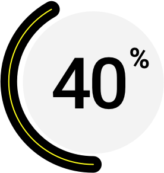

# Progress Status Overview:

# Park System build Using Django.

## Languages and frameworks.
 * Python - Django
 * Bootstrap
 * HTML
 * CSS
 * JS

## To manage versions.

 * Git / GitHub
 * Virtualenv
 
## Databases.

 * SQLite (To development)
 * PostgreSQL (To deploy)
 
 ## Hosts.
 
 * Heroku
 
 ## Text Editor / IDLE
 
 * VSCode

